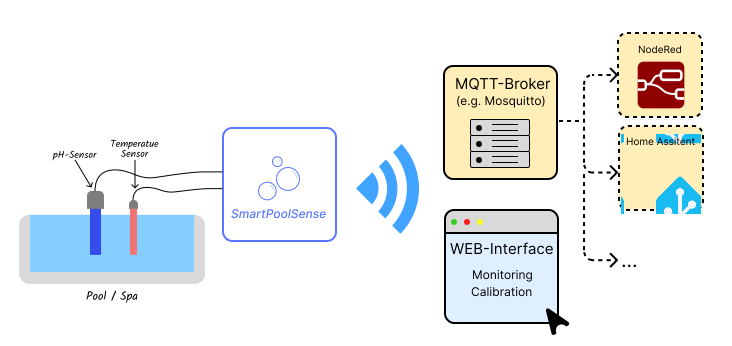
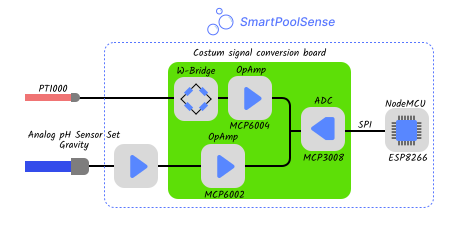

---

Smart Pool Sense is an IoT solution for automatically and continuously monitoring the water temperature and pH level of pools and spa.

The system collects sensor data and publishes it via MQTT, allowing seamless integration with smart home automation platforms (e.g., Home Assistant, NodeRed, openHAB, etc.).

A built-in web interface provides real-time access to sensor readings and allows for easy calibration of both the temperature and pH sensors.

The following diagram illustrates a possible Smart Pool Sense setup in a smart home environment:



Figure 1: Overview of a possible Smart Pool Sense setup in a smart home environment

## ✨ Features

- 🌡️ **Temperature Compensation for pH Sensor:** Enhances the accuracy of pH level measurements
- 📡 **MQTT Protocol**: Publishes sensor readings via **MQTT** for easy integration with **Home Assistant**, **NodeRed**, etc.
- 🔧 **Over-the-Air (OTA) Updates**: Firmware upgrades without physical access
- 🌐 **Web Interface**: Offers a built-in **web interface** for real-time data access and **sensor calibration**
- 🧩 **Modular Architecture**: Easily extendable with additional sensors

## 📦 Software Dependencies

Managed via PlatformIO (`platformio.ini`)

- ArduinoJson
- MCP_ADC (driver for MCP3008)
- Preferences
- PubSubClient (MQTT)

## 🔧 Hardware Requirements

| Component                | Model/Type          |
|--------------------------|---------------------|
| Microcontroller          | ESP8266 (NodeMCU)   |
| Temperature Sensor         | PT1000 (waterproof) |
| pH level Sensor          | Analog pH Sensor (DFRobot Gravity) |
| Costum signal conversion board  | for more information see under `docs/hardware` |
| Power Supply             | 5V, 2A              |
| Enclosure                | Weatherproof case   |

<br>



*Figure 2: Hardware overview of the Smart Pool Sense*

## 🖥️ Software Requirements

- **Firmware**: PlatformIO CLI (installed via VS Code extension or globally as `pio`)
- **Broker**: MQTT-Broker (e.g., Mosquitto)
- **Internet Browser**: A standard Internet Browser (e.g. Chrome or Firefox)

## 🚀 Getting Started
**How to get the source code of Smart Pool Sense:**

Clone the repository:<br>
   ```bash
   git clone https://github.com/HaedrichHC/SmartPoolSense.git
   cd SmartPoolSense
   ```

## ⚙️ Configuration
**How to configurate the Smart Pool Sense:**

Before you can build the firmware and upload it to the ESP8266, you need to configure the following settings in `config.h` and `secret.h`, you find them under `includes/configs/`:

### config.h

Required: MQTT-Configuartion
```cpp
// MQTT-Configuartion
#define MQTT_TOPIC "Garden/Pool"		  // MQTT Topic
#define MQTT_PAYLOAD_SIZE (128)           // Size of the MQTT Payload
#define MQTT_RECONNECT 5000               // Reconnect Interval to MQTT Broker in ms
#define MQTT_PUBLISH 15000                // Publish Interval to MQTT Brokerin ms
```
Optional: Default sensor calibration values
```cpp
// Default Temperature Sensor calibration values
#define TEMP_VALUE_1 10.4
#define TEMP_VOLT_1 1640
#define TEMP_VALUE_2 49.0
#define TEMP_VOLT_2 4400

// Default pH-level Sensor calibration values
#define PH_VALUE_1 7.0
#define PH_VOLT_1 2880
```
Optional: AD-converter configuration
```cpp
// ADC-Configuartion
#define ADC_CS_PIN 15
#define ADC_TEMP_CH 0
#define ADC_PH_CH 1
#define ADC_V_REF 5
```
Optional: Storage configuration for sensor calibration data
```cpp
// Calibration-storage-Configuration
#define STORAGE_PATH "calib_data"
```

### secret.h
First, rename `secret.h.example` to `secret.h` and configure the following settings with your own credentials:

Wifi-Configuration:
```cpp
// WIFI-Configuration
const char* WIFI_SSID = "YourSSID";			    // SSID of your WLAN
const char* WIFI_PASSWORD = "YourPassword";	    // Password of your WLAN
```
MQTT-Server-Configuration:
```cpp
// MQTT-Server-Configuration
const char* MQTT_SERVER = "YourMqttServerIP"; // IP-Adress of your MQTT-Broker
const int MQTT_PORT = 1883 					  // MQTT-Port (standard: 1883)
```
OTA-Configuration:
```cpp
// OTA-Configuration
const char* OTA_HOSTNAME = "hostname";		 // OTA hostname 
const char* OTA_PASSWORD = "password"; 		 // OTA password
```

## 🔧⚡Build and Flash Firmware
**How to build and flash the firmware and filesystem image:**

For the initial upload, ensure that your ESP8266 is connected via USB and that PlatformIO is using the correct serial port. Subsequent firmware updates can be done via OTA (see the OTA Updates section)

1. Build and flash the firmware:<br>
   
   ```bash
   cd firmware
   pio run --target upload
   ```
2. Build filesystem Image:<br>
   To create the filesystem image, run the following command:
   ```bash
   pio run --target buildfs
   ```
3. Upload filesystem to ESP8266:<br>
   To upload the filesystem image to the ESP8266, run:
   ```bash
   pio run --target uploadfs
   ```

## 📐 Sensor Calibration
**How to Calibrate the Sensors:**

1. Open a web browser of your choice.
2. Enter the IP address of your ESP device into the address bar and press Enter.
3. Navigate to the "Calibration" menu item.
4. On this page, you can perform the calibration of the sensors.

For a detailed step-by-step guide, please refer to the **Wiki** section of this repository.

## ⚡ OTA Updates

To use the OTA update feature, the following lines in the platformio.ini file must be uncommented and adjusted accordingly:

```ini
;upload_protocol = espota
;upload_port = 192.168.1.10  ;IP-Adress of your ESP8266
;upload_flags = 
;	--auth='password'        ;Your OTA password
```
## 🐛 Troubleshooting

- **Can't connect to WLAN**:
  - Check WIFI ssid and password in `secret.h`
  - Ensure the WIFI is connected
- **Can't connect to MQTT**:
  - Check broker IP-Adress and port in `secret.h`
  - Ensure the broker is running
- **Incorrect sensor readings**:
  - Check wiring and sensor addressing
  - Repeat sensor calibration

## 📜 License

This project is licensed under the GPL-3.0 License. See [LICENSE](LICENSE) for details.